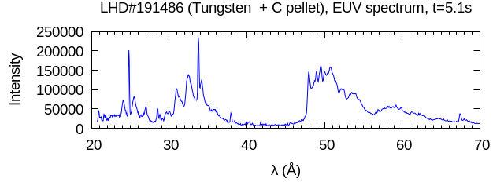
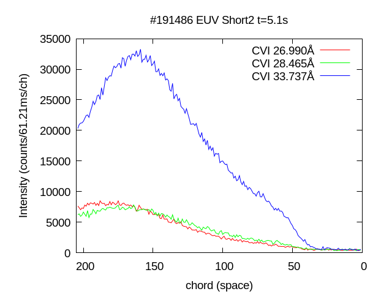
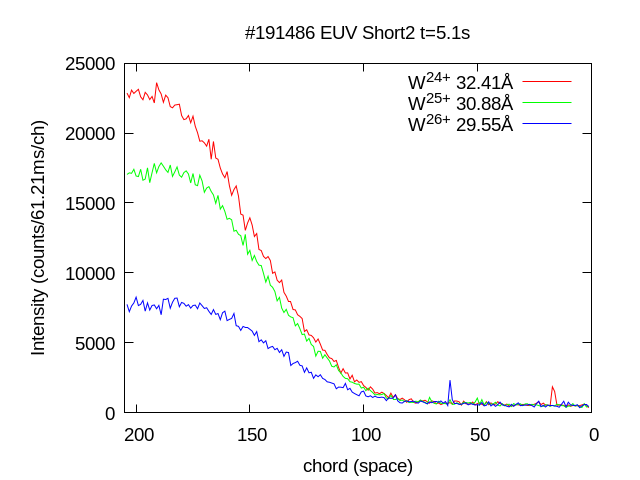

# Slice & Stack for impurity emissivity profile

Analyze impurity emissivity profile from "EUV short2" spectrometer of LHD.<br>
Detail of "Slice & Stack" : [R. Nishimura et al., Atoms 13, 21 (2025).](https://www.mdpi.com/2218-2004/13/2/21 "articke")<br>


### input file ( slice_stack/input )

#### 1. Intensity data of "EUV short2"
a sample of intensity is in slice_stack/input/input/intensity_f51.dat.<br>

`intensity_f51.dat`
```
# LHD#191486 "EUV Short2" t = 5.1s
# column 1 : index of line-of-sight
# column 2 : intensity ( CVI 26.990 Å    )
# column 3 : intensity ( CVI 28.465 Å    )
# column 4 : intensity ( CVI 33.737 Å    )
# column 5 : intensity ( W^{24+} 32.41 Å )
# column 6 : intensity ( W^{25+} 30.88 Å )
# column 7 : intensity ( W^{26+} 29.55 Å )
           1         473         421         588         367         479         435
           2         416         520         390         500         416         589
           3         358         546         420         618         652         591
           4         601         348         462         564         384         493
           5         505         454         614         515         429         368
           ...
         202        7051        5960       21192       23068       17121        7632
         203        7367        6363       20968       22529       17153        7227
         204        7656        6231       20327       22857       17038        7753

```

column 1 is chord (Z). column 2-7 is intensities of carbon ant tungsten.<br>


#### 2. line-of-sight data
dataset is already given in input/los_short2.dat.

#### 3. magnetic surface data, reff(R,Z).
prepare the magnetic surface data, reff(R,Z) from "tsmesh_h" datafile.<br>
download from [LHD Data Repository](https://www-lhd.nifs.ac.jp/pub/Repository_en.html "lhd").<br>
or

```bash
wget -q -O "tsmesh_h_XXXXXX.txt" "https://exp.lhd.nifs.ac.jp/opendata/LHD/webapi.fcgi?cmd=getfile&diag=tsmesh_h&shotno=XXXXXX&subno=1" # XXXXXX is shot No.
```

"tsmesh_h_XXXXXX" file includes reff(t,R,Z) profiles.<br>
For extraction of specific frame : 

```
cd slice_stack/tsmesh_h
./get_tsmesh_h.sh   # get data from web
make
./a.out
```

here, set below parameters in "calc_tsmesh_h.f90"
- f = 51    (Frame No. of EUV short2)
- call rd_inpfile( "tsmesh_h_191486.txt" )  (set the shot No)

then, "thmesh_h_fXX.dat" file is generated.<br>
copy "thmesh_h_fXX.dat" file slice_stack/input<br>

`tsmesh_h_f51.dat`
```
 # shot  :       191486
 # frame :          116
 # time  :    5.1002999999999998     
    2.300000E+00   -1.600000E+00    1.000000E+01
    2.350000E+00   -1.600000E+00    1.000000E+01
    2.400000E+00   -1.600000E+00    1.000000E+01
    2.450000E+00   -1.600000E+00    1.000000E+01
    ... (R, Z, reff(R,Z))
    5.400000E+00    1.600000E+00    1.000000E+01
    5.450000E+00    1.600000E+00    1.000000E+01
    5.500000E+00    1.600000E+00   -1.000000E+01
```


## compile

```bash
$ sudo apt install gfortran   
$ sudo apt install gnuplot    # for plotting result
$ sudo apt install evince     # show result
```

```bash
$ cd slice_stack
$ make

gfortran \
src/mod_math.f90 \
src/mod_tsmesh_h.f90 \
src/mod_long2.f90 \
src/mod_length_matrix.f90 \
main.f90 -O2
```

## run

```bash
$ ls input/
check_los          los_long2.dat   tsmesh_h_f51.dat
intensity_f51.dat  los_short2.dat

$ make

$ ./a.out
 time :    5.0999999999999996
 total 6 of CVI and Tungsten Lines
 .................... input/los_short2.dat ....................
 .................... input/tsmesh_h_f51.dat ....................
 LOS#     1 L_tot (m)    0.9512   reff_min (m)    6.7378E-01
 LOS#    26 L_tot (m)    1.2512   reff_min (m)    5.7484E-01
 LOS#    51 L_tot (m)    1.5321   reff_min (m)    4.7170E-01
 LOS#    76 L_tot (m)    1.8509   reff_min (m)    3.7392E-01
 LOS#   101 L_tot (m)    2.0005   reff_min (m)    2.8580E-01
 LOS#   126 L_tot (m)    2.1502   reff_min (m)    2.0622E-01
 LOS#   151 L_tot (m)    2.3000   reff_min (m)    1.3193E-01
 LOS#   176 L_tot (m)    2.5998   reff_min (m)    6.2040E-02
 .................... input/intensity_f51.dat ....................
```

result files are
```bash
$ ls *.dat
LIcalc_f51.dat  # calculated line-integrated intensity
LIexp_f51.dat   # same as input/intensity_f51.dat
Lmat_f51.dat    # length matrix data
emis_f51.dat    # emissivity data of C and W lines
```

for plot of the result,
```bash
gnuplot plot_temp.gp
```


## about sample data

- LHD#191486
- Tungsten + Carbon pellet

<br>
<br>
<br>
